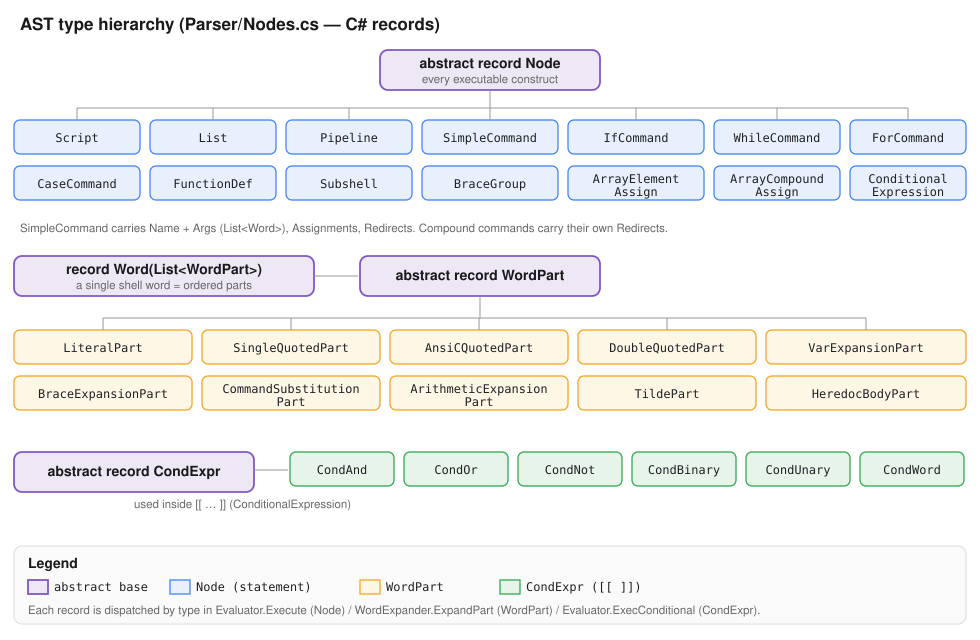
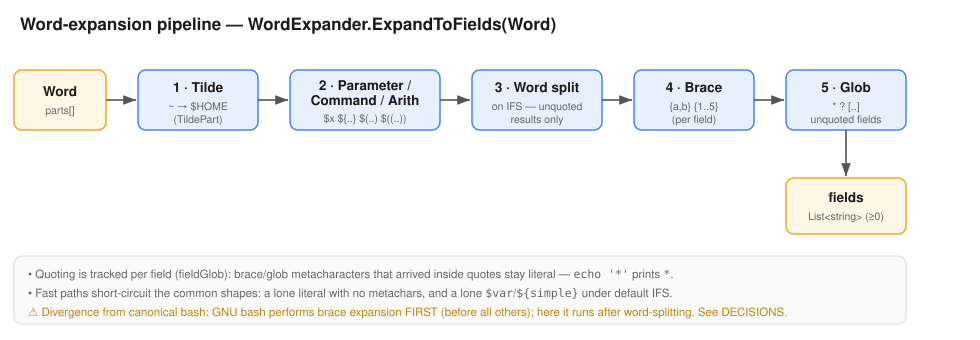
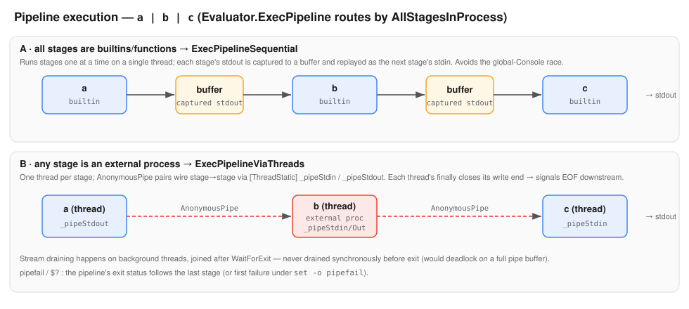
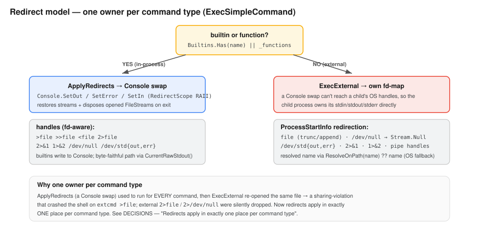

# Bash — Architecture

> **Maintenance contract.** This document is **locked by default.** Edit it only on a
> **structural** change: a stage or subsystem added/removed/re-wired, the pipeline shape
> changing, an architectural invariant changing, or the conceptual model shifting. A new
> method or a tweaked signature must **not** trigger an edit here — that belongs in
> [`IMPLEMENTATION.md`](IMPLEMENTATION.md), which tracks the code surface sitting on top of
> this (unchanged) architecture. *Why* each choice was made lives in
> [`DECISIONS.md`](DECISIONS.md); *what exists right now / what's next* lives in
> [`PROJECT_CONTEXT.md`](PROJECT_CONTEXT.md).

---

## 1. Goals & non-goals

A standalone Windows **bash interpreter written in C#** — a drop-in replacement for msys2
bash that requires **no WSL and no msys2**. It targets POSIX shell core plus the most-used
bashisms (`[[ ]]`, indexed & associative arrays, `local`, arithmetic expansion, brace
expansion), and ships an in-process implementation of the common AT&T System V command set so
everyday scripts run without paying Windows' process-spawn cost.

Non-goals: full bash 5.x fidelity (no `coproc`, no process substitution `<()`), no true
job-control process groups, no real Unix VFS. See [`PROJECT_CONTEXT.md`](PROJECT_CONTEXT.md)
§"Out of Scope" for the live list, and §9 below for the platform divergences that follow from
"no `fork()`".

---

## 2. The four-stage pipeline

The interpreter is a classic **scanner → parser → AST → tree-walking evaluator** front-end.
Source text becomes a flat token stream, the tokens become an abstract syntax tree, and the
evaluator walks that tree to produce output and an exit code. `Program.cs` is the entry point
and (in interactive mode) the REPL that drives all four stages.

| Stage | Directory | Produces |
|-------|-----------|----------|
| Lexer | `Lexer/` | `List<Token>` |
| Parser | `Parser/` | AST (`Node`) |
| AST | `Parser/Nodes.cs` | the node/record types |
| Evaluator | `Evaluator/` | stdout + exit code |

Each boundary is a plain data structure (tokens, then nodes), so the stages are independently
testable and the parser never reaches back into the lexer's character stream.

---

## 3. Relation to well-known architectures

If you have built or read an interpreter before, or you know bash internals, this section
maps the design onto familiar ground.

**(a) The textbook tree-walking interpreter.** This is a clean instance of the front-end
taught in the Dragon Book / *Crafting Interpreters*: a hand-written scanner, a recursive-descent
parser building an AST of typed nodes, and an evaluator that dispatches on node type. There is
no bytecode and no JIT — the evaluator walks the tree directly.

**(b) GNU bash's own module structure.** The responsibilities line up almost one-to-one with
bash's source layout, which makes bash's documentation a usable reference for this codebase:

| GNU bash | This project |
|----------|--------------|
| `parse.y` (yacc grammar + `yylex`) | `Lexer/` + `Parser/` (hand-written recursive descent) |
| `command.h` `COMMAND` tree | `Parser/Nodes.cs` records |
| `execute_cmd.c` | `Evaluator/Evaluator.cs` |
| `subst.c` (word expansions) | `Evaluator/WordExpander.cs` |
| `expr.c` (arithmetic) | `Evaluator/ArithParser.cs` |
| `variables.c` | `Evaluator/ShellEnvironment.cs` |
| `builtins/*.def` | `Evaluator/Builtins.cs` |
| `jobs.c` (process groups) | `Evaluator/BackgroundJob.cs` + threads |
| `lib/readline/` | `IO/LineEditor.cs` + `History` / `CompletionEngine` / `PromptExpander` |

We follow the **POSIX shell command-language grammar** for the parse (lists → pipelines →
commands → words; the compound commands; redirection operators), and the **bash** dialect for
expansions and `[[ ]]`.

**(c) Where we deliberately diverge.** The interesting departures are all forced by the host
platform and are detailed in §9. In short: Windows has no `fork()`, so where bash spawns a
process per builtin and per pipeline stage, we run builtins **in-process** and wire pipelines
with **threads**; where bash dup2's file descriptors, we swap **`Console` streams** for
in-process commands and hand **OS handles** to child processes; and where bash uses glibc
regex, we use **.NET regex** with a BRE→ERE translation shim.

---

## 4. Lexing model

The lexer (`Lexer/Lexer.cs`) turns source text into `Token`s (`Lexer/Token.cs`,
`Lexer/TokenType.cs`). Four properties of the token stream are load-bearing for everything
downstream:

- **`HasLeadingSpace` is the word-boundary signal.** Every token records whether whitespace
  preceded it. The parser fuses adjacent tokens into a single word only while the next token
  has *no* leading space — so `echo"hi"` is one word but `echo "hi"` is two. Array-compound
  detection (`arr=(…)`) also keys on the `(` having no leading space.

- **`${…}` is consumed whole, in the lexer.** The lexer is context-free; it does not know it
  is "inside" a parameter expansion. So `ConsumeDollar` reads the entire `${…}` body eagerly
  (balancing nested braces and quotes) and stores the raw interior as a single token. This is
  what prevents `#` in `${#arr[@]}` from starting a comment, `}` in `${x:-y}` from leaking,
  and operator characters inside the expansion from being mis-tokenised. *(DECISIONS:
  2026-06-13 — "All `$`-expansions routed through one path".)*

- **Heredoc bodies are captured after the newline.** `<<` / `<<-` queue a delimiter; on the
  next newline `FlushHeredocs` reads the body lines and emits a heredoc-body token.

- **`{` and `}` are context-sensitive.** `{` is a group-open only when followed by
  whitespace/`;` (so `{a..e}` lexes as a word); `}` is a group-close only with leading space,
  a preceding newline, or a preceding `;`. *(DECISIONS: 2026-06-13 — "`}` recognised as a
  group terminator in command position".)*

`$'…'` ANSI-C quoting (with `\n`, `\t`, `\xNN`, `\uNNNN` decoding) is also resolved in the
lexer. When the lexer reaches EOF mid-construct (open quote, open heredoc) it raises a
`LexException` flagged `Incomplete`, which the REPL uses to ask for a continuation line.

---

## 5. Grammar & AST

The parser (`Parser/Parser.cs`) is **recursive descent**, mirroring the POSIX grammar:
`ParseList` → `ParsePipeline` → `ParseCommand` → (`ParseSimpleCommand` | compound) →
`ParseWord`. Two parse rules are worth singling out:

- **`ParseList` continues through `;`**, not just `&&`/`||`, stopping only at a list
  terminator word (`done`, `fi`, `esac`, `elif`, `else`, `then`, `do`). Otherwise
  `while …; do a; b; done` would parse only `a`.

- **A word is a list of `WordPart`s.** Quoting and expansion structure is preserved in the
  tree (literal vs single-quoted vs double-quoted vs `$var` vs `${…}` vs `$(…)` vs `$((…))`
  vs `~` vs heredoc body) rather than being flattened to a string — the evaluator needs that
  structure to apply the right expansion and to know what was quoted.

The full type hierarchy:

There are three abstract roots: **`Node`** (every executable construct), **`WordPart`** (the
pieces of a `Word`), and **`CondExpr`** (the `[[ … ]]` expression tree). Incomplete compound
commands (e.g. an unterminated `if`) raise a `ParseException` flagged `Incomplete`, again
feeding the REPL's continuation loop.

---

## 6. Evaluation model

`Evaluator.Execute(Node)` is a single type-switch that dispatches each node to its handler
(`ExecList`, `ExecPipeline`, `ExecSimpleCommand`, `ExecIf`, `ExecWhile`, `ExecFor`,
`ExecCase`, `ExecFunctionDef`, `ExecConditional`, …). The tree is walked directly; there is no
separate compile step.

Two cross-cutting mechanisms:

- **Per-statement error isolation.** Top-level statements run through `RunStatement`, which
  catches `EvalException` (and other runtime faults like divide-by-zero), prints
  `bash: …`, sets `$?` to a failure code, and continues with the next statement — matching how
  an interactive bash session survives a bad command. *(DECISIONS: 2026-06-14 — `/dev/null` &
  fd-aware redirects & error-continue.)*

- **Control flow as exceptions.** `exit`, `return`, `break`, `continue` and Ctrl-C unwind via
  dedicated exceptions (`ExitException`, `ReturnException`, `BreakException`,
  `ContinueException`, `InterruptException`) caught at the right boundary (function body, loop,
  REPL). This keeps the normal walk free of status-plumbing.

---

## 7. Word-expansion pipeline

`WordExpander.ExpandToFields(Word)` applies the expansion passes in order and returns the
field list a command actually receives. `ExpandToString` is the no-split / no-glob variant
used where a single string is wanted (assignments, redirect targets, `case` words).

Quoting is tracked **per field**: a brace/glob metacharacter that arrived inside quotes stays
literal, so `echo '*'` prints `*`. Two fast paths short-circuit the overwhelmingly common
shapes (a lone literal with no metacharacters; a lone `$var`/`${simple}` under default IFS)
to avoid allocation. *(DECISIONS: 2026-06-13 — empty expansions yield zero fields; quoting
fixes; and the quoted-glob fix of 2026-06-14.)*

> **Divergence:** canonical bash performs brace expansion **first**, before all other
> expansions; this implementation performs it **after** word-splitting. The common cases
> agree; pathological mixes of braces and unquoted expansions can differ.

---

## 8. Arithmetic

Arithmetic (`$((…))`, `(( ))`, array subscripts) is evaluated in two steps. First
`WordExpander.ExpandVarsInArith` substitutes variable references — including **bare
identifiers** with no `$`, since `$((x+1))` is legal — defaulting unset names to `0`. The
resulting purely-numeric/operator string is handed to `ArithParser`, a recursive-descent
**precedence-climbing** evaluator (`ParseTernary → ParseOr → … → ParsePrimary`) over C#
`long`, supporting the C operator set including `&&`/`||`, bit ops, shifts, `**`, and hex/octal
literals. *(DECISIONS: 2026-06-14 — Perf round 2: ArithParser inline rewrite.)*

---

## 9. Execution & I/O model

This is where the platform divergences concentrate.

### 9.1 Pipelines

`ExecPipeline` chooses a strategy based on `AllStagesInProcess`:

- **All stages are builtins/functions → `ExecPipelineSequential`.** Builtins write to the
  process-global `Console`, so running three+ of them concurrently would clobber each other's
  stream redirection. Instead the stages run one at a time on a single thread, each stage's
  stdout captured and replayed as the next stage's stdin.

- **Any stage is an external process → `ExecPipelineViaThreads`.** External processes need
  live OS pipe handles (synchronous draining before exit would deadlock on a full pipe
  buffer), so each stage runs on its own thread wired with `AnonymousPipe` pairs passed via
  `[ThreadStatic]` `_pipeStdin`/`_pipeStdout`. Every thread's `finally` closes its write end
  to signal EOF downstream; stream draining is on background threads joined after
  `WaitForExit`.

The pipeline's exit status follows the last stage, or the first failure under
`set -o pipefail`. *(DECISIONS: 2026-06-14 — builtin-pipeline race (sequential) + CRLF
output; 2026-03-11 — Pipeline via thread + MemoryStream.)*

### 9.2 Redirects

Redirects apply in **exactly one place per command type** — the central correctness rule of
the I/O model:

- **Builtins & functions** run in-process, so `ApplyRedirects` swaps the `Console` streams
  (`SetOut`/`SetError`/`SetIn`) under a `RedirectScope` RAII guard that restores the streams
  and disposes any opened `FileStream`s on exit.

- **External processes** can't be reached by a `Console` swap — a child writes to OS handles —
  so `ExecExternal` owns a self-contained fd-map and configures the child's
  `ProcessStartInfo` directly (file truncate/append, `/dev/null` → `Stream.Null`,
  `/dev/stdout`·`/dev/stderr`, `2>&1`, `1>&2`, and pipeline handles), for stdin, stdout
  **and** stderr.

Running `ApplyRedirects` unconditionally *and* re-opening in `ExecExternal` was the bug that
crashed the shell on `extcmd >file` (sharing violation) and silently dropped external
`2>file`. *(DECISIONS: 2026-06-14 — "Redirects apply in exactly one place per command type".)*

### 9.3 Byte-faithful output

Builtins that must emit exact bytes (e.g. `cat`, `od`) bypass the text `Console` via
`CurrentRawStdout()`, which returns the raw byte sink in effect (a file-redirect `FileStream`,
a pipe stream, or the real stdout) or `null` when output is being captured by `$( )`. Console
newlines are forced to LF, not CRLF. *(DECISIONS: 2026-06-14 — Byte-faithful stdout for
builtins.)*

---

## 10. In-process coreutils

To avoid Windows' per-process spawn cost (no `fork`; `CreateProcess` plus AV scanning is a
multi-millisecond floor), the common AT&T System V command set is implemented **in-process**
as builtins dispatched from `Builtins.TryExecute`. Scope is "bash-adjacent" — self-contained,
bounded, byte-faithful, destructive-safe tools (text/file/dir utilities, `grep`/`sed`,
`find`, `sort`, …) — explicitly **not** a full busybox. *(DECISIONS: 2026-06-14 — In-process
coreutils scope; Coreutils scope = AT&T System V filtered by feasibility; Wave-4 scope.)*

Two model points:

- **Regex dialect.** `grep` and `sed` default to **BRE**, translated to .NET regex by a
  `BreToNet` shim (`\(…\)`, `\{m,n\}`, `\+ \? \|` are operators; bare `()/{}/+/?/|` are
  literal); `-E`/`-r` selects ERE; `-F` is literal. *(DECISIONS: 2026-06-14 — grep/sed
  default to BRE.)*
- **Re-entrancy.** Builtins that drive other commands (`xargs`) call back through
  `Evaluator.RunCommand`, which re-enters the builtin→function→external dispatch.

---

## 11. Environment & scoping

`ShellEnvironment` holds variables, exports, and the positional-parameter / scope stack.
Indexed arrays use a `SortedDictionary<int,string>` (preserving index order through sparse
assignment and `unset`); associative arrays use a `Dictionary<string,string>`. Function calls
push a scope frame (`PushScope`/`PopScope`) carrying their own positionals; `local` binds into
the current frame. Special variables (`$?`, `$#`, `$@`, `$*`, `$0`, `$1…`) and exports are
resolved here. *(DECISIONS: 2026-06-13 — `$`-expansions unified, positional parameters; array
`@`/`*` field expansion.)*

---

## 12. External commands & the path model

For a command that is neither builtin nor function, `ExecExternal` launches a child process.
Two pieces of machinery sit in front of `Process.Start`:

- **PATH resolution + hash cache.** `ResolveOnPath` scans `PATH` (with `PATHEXT` on Windows)
  and memoises hits; `psi.FileName = ResolveOnPath(name) ?? name`, so a cache miss falls back
  to the OS launcher's own search and can only ever speed things up, never break resolution.
  This cache is what the `hash` builtin inspects/clears. *(DECISIONS: 2026-06-14 — hash + PATH
  cache.)*

- **Shebang dispatch.** Windows can't `exec` a `#!` script, so when a command names an actual
  script file the interpreter reads its interpreter line: `bash`/`sh` scripts run in-process
  in a child `Evaluator`; anything else is spawned as `<interp> <script> <args>`. *(DECISIONS:
  2026-06-14 — Shebang dispatch.)*

**`TranslatePath`** maps `~`/`~user` and forward-slash paths to Windows paths. A general Unix
root mapping (`/tmp`, `/usr`, `/etc`, configurable `BASH_ROOT`) is a **deferred** design
decision — see [`DECISIONS.md`](DECISIONS.md) "DEFERRED — Unix root path mapping" and
[`PROJECT_CONTEXT.md`](PROJECT_CONTEXT.md) "Open Questions".

---

## 13. Interactive layer & startup

The interactive subsystem lives in `IO/`:

- **`LineEditor`** — a key-by-key reader with readline-style editing, history navigation, and
  tab completion (`DoComplete`), redrawing with a self-correcting anchor to avoid flicker.
  *(DECISIONS: 2026-06-13 — line editor; line-editor flicker.)*
- **`History`** — persisted to `~/.bash_history`, ignoring consecutive duplicates, bounded by
  `HISTSIZE`.
- **`CompletionEngine`** — command/file/variable completion.
- **`PromptExpander`** — `PS1`/`PS2` escape and parameter expansion.

`Program.cs` orchestrates **invocation and startup**: it parses flags (`-c`, a script path,
`-l`/`--login`, `-i`, `--norc`, `--noprofile`, `--rcfile`), then dispatches to one of three
modes — run a `-c` string, run a script file (sourcing `$BASH_ENV` first), or the interactive
REPL. Startup files follow bash order (login: `/etc/profile` then the first of
`~/.bash_profile`/`~/.bash_login`/`~/.profile`; interactive non-login: `/etc/bash.bashrc` then
`~/.bashrc` or `--rcfile`). The REPL accumulates continuation lines (backslash-newline, and
`Incomplete` lex/parse exceptions) before executing, and runs `PROMPT_COMMAND` before each
prompt. *(DECISIONS: 2026-06-13 — Startup files, invocation flags, prompt; multi-line
continuation via Incomplete.)* The standard bash startup sequence this mirrors is captured in
[`docs/bash-startup-reference.md`](docs/bash-startup-reference.md).

---

## 14. Signals & jobs

There is no Unix signal delivery on Windows, so:

- **Ctrl-C** is handled by a polled interrupt flag. `Console.CancelKeyPress` calls
  `RequestInterrupt`; loop and command boundaries call `CheckInterrupt`, which throws
  `InterruptException`; the REPL catches it, prints a newline, and sets `$?` to 130. During
  line editing the editor takes Ctrl-C as input instead. *(DECISIONS: 2026-06-13 — SIGINT via
  polled interrupt flag.)*
- **Traps** support `EXIT` and `INT`; other signals are stored but inert. `RunExitTrap` fires
  on every exit path. *(DECISIONS: 2026-06-13 — Traps: EXIT and INT only.)*
- **Background jobs** (`&`) run as in-process threads (`BackgroundJob`, `StartBackgroundJob`),
  not child process groups; `fg` hands the terminal over where possible, `bg` reports
  unsupported. *(DECISIONS: 2026-06-13 — Background jobs as in-process threads.)*

---

## 15. Map of the design to the code

For the concrete class/method surface implementing each subsystem above — and an end-to-end
walk-through of a single command — see [`IMPLEMENTATION.md`](IMPLEMENTATION.md).
