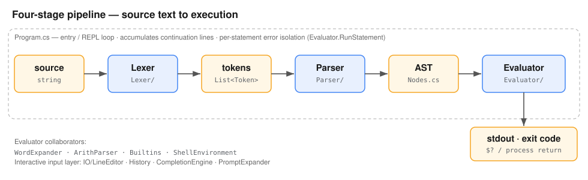

# C#Bash

*(The GitHub repo is named `csharpBash` — GitHub doesn't allow `#` in repository names.)*

A standalone **bash interpreter for Windows, written in C#** — no WSL, no msys2, no Cygwin. It targets POSIX shell core plus the most-used bashisms, and runs the common Unix command set **in-process** so everyday scripts don't pay Windows' per-process spawn cost.

> **Provenance, stated plainly.** The architecture was human-directed; the code was written, tested, and optimised by Claude (Anthropic). It was developed under **Mercurial** — the full commit history is in [`MERCURIAL_HISTORY.md`](MERCURIAL_HISTORY.md), and the real repository ships as the `mercurial-history.hg` bundle (`hg unbundle mercurial-history.hg`). The story behind it: [*It's moosh all the way down*](https://www.linkedin.com/pulse/its-moosh-all-way-down-guy-mcilroy-mer9c/).

## What it does

**Language:** pipelines; lists (`&&`, `||`, `;`, `&`); redirections including fd-aware `2>`, `>>`, `<`, `&>`, `/dev/null`, `/dev/std*`, `2>&1`, `1>&2`, numbered descriptors (`exec 3>f`, `>&3`); here-documents and here-strings; command substitution `$(…)` and backticks (nested, isolated like a subshell); arithmetic `$(( … ))`, `(( … ))` and `for (( ; ; ))` with assignment and `++`; brace expansion `{a,b}` / `{1..9}`; tilde and pathname (glob) expansion with `nullglob`/`dotglob`/`globstar`/`nocaseglob`; single / double / `$'…'` quoting with bash's exact backslash rules.

**Variables & structure:** assignments and `+=`, `export`, `local`, `readonly`, `declare -i/-a/-A/-r/-x/-p/-f`, special parameters (`$?`, `$#`, `$@`, `$*`, `$0…`, `$!`, `$-`, `PIPESTATUS`, `BASH_REMATCH`, `LINENO`, `FUNCNAME`, `BASH_SOURCE`, `RANDOM`, `PPID`, `UID`); the parameter-expansion operators (`${x:-y}` `${x:n:m}` `${x#pat}` `${x/pat/rep}` `${x^^}` `${!x}` `${arr[@]:n}` …); indexed and associative arrays; `if` / `while` / `until` / `for` / `case`; functions (both syntaxes); `[[ … ]]` with `&&`/`||`/`( )`, `=~` and pattern matching; `set -e/-u/-x/-o pipefail`, `shopt`.

**Paths:** MSYS drive-letter form (`/c/Users/…`) and `/tmp` are understood alongside native `C:\…`, and the conversion is symmetric — `pwd`, `$PWD`, `mktemp` and `realpath` hand back `E:/dir/file`, a valid Windows path containing no backslashes. That matters because backslash is the shell's *escape* character: a path with backslashes in it is a value the shell's own `${p#…}`, globs, `case` and `[[ … ]]` would misread.

**Bytes:** a shell string is a byte sequence, so `printf '\377'` emits one byte, not the UTF-8 encoding of a character, and data that is not valid UTF-8 survives variables, `$(…)`, pipes and files intact. (It survives NUL too, which real bash cannot hold.)

**Interactive & runtime:** a readline-style line editor with history (`~/.bash_history`), tab completion, and `PS1`/`PS2` prompts; startup-file sourcing (login + interactive); invocation flags (`-c`, `-l`/`--login`, `--norc`, `--rcfile`, script files, shebang dispatch); `trap` (EXIT/INT); background jobs; Ctrl-C handling.

## Embedded commands

To avoid the Windows process-spawn cost, the common AT&T System V toolset is implemented in-process:

- **Shell:** `echo` `printf` `cd` `pwd` `pushd` `popd` `dirs` `export` `unset` `readonly` `set` `shopt` `shift` `read` `mapfile`/`readarray` `getopts` `test`/`[` `type` `command` `builtin` `alias` `unalias` `eval` `exec` `source`/`.` `local` `declare`/`typeset` `let` `trap` `jobs` `wait` `fg` `bg` `kill` `sleep` `env` `history` `exit` `return` `break` `continue` `true` `false` `:`
- **Text:** `cat` `head` `tail` `wc` `rev` `tac` `tr` `cut` `uniq` `nl` `fold` `paste` `comm` `seq` `split` `od` `sort` `tee` `base64` `md5sum`/`sha1sum`/`sha256sum`/`sha512sum` `hexdump`
- **Files & dirs:** `touch` `mkdir` `rmdir` `rm` `mv` `cp` `cmp` `du` `ls` `find` `stat` `mktemp` `realpath` `readlink` `chmod` `ln` `truncate` `basename` `dirname`
- **Search & transform:** `grep`/`egrep`/`fgrep` `sed` `awk` (a documented subset) `diff` `xargs` `expr` `factor` `cal`
- **System:** `date` (incl. `-d` "3 days ago"-style parsing) `uname` `hostname` `arch` `nproc` `tty` `whoami` `id` `printenv` `timeout` `which` `kill` `hash` `pgrep` `pkill` `ps` (Windows has no procps; `pkill -f` never kills this shell's own ancestors)

Every tool parses its options strictly: an option (or awk construct) that is not implemented is
**never silently ignored** — the tool reports it and, when a real external of the same name is on
PATH, re-runs the command there (`BASH_COREUTILS=builtin` forbids that, `=external` prefers it).
When Git for Windows is installed, its `usr/bin` is put on PATH exactly as Git Bash does, so
`tar`, `perl`, `ssh`, … and any tool outside this list resolve the same way. `grep` and `sed`
default to POSIX **BRE** (`-E`/`-r` for ERE). Process substitution `<( )` works (temp-file
emulation); `>( )` is refused with a clear message. See [`ARCHITECTURE.md`](ARCHITECTURE.md) §10.

## Performance

Measured on one Windows 10 machine against the two other bash shells available on it: **Git for Windows** bash 4.4 (bash on the MSYS2 POSIX emulation layer) and **WSL 2** bash 5.1 (native Linux bash, reaching Windows files over `/mnt`). Same scripts, best of three, wall clock in seconds including process startup. Reproduce with `tests/bench/compare3.sh`.

| benchmark | C#Bash | Git Bash | WSL bash | vs Git | vs WSL |
|---|---:|---:|---:|---:|---:|
| `loop` — 200 k `while` iterations | **0.169** | 1.499 | 0.433 | 8.9× | 2.6× |
| `arith` — 200 k `$(( ))` evaluations | **0.259** | 2.093 | 0.632 | 8.1× | 2.4× |
| `func` — 100 k function calls | **0.229** | 2.319 | 0.589 | 10.1× | 2.6× |
| `loop_big` — 2 M iterations | **1.389** | 15.082 | 3.481 | 10.9× | 2.5× |
| `coreutils` — 900 `basename`/`dirname`/`wc` calls | **0.078** | 20.303 | 0.777 | **260×** | 10.0× |
| `pipeline` — `grep\|sed\|sort\|uniq\|awk` over 50 k lines | 0.260 | 0.353 | **0.136** | 1.4× | 0.5× |
| `find` — walk 400 files | **0.055** | 0.226 | 0.218 | 4.1× | 4.0× |
| startup — `bash -c 'exit 0'` | 0.030 | **0.027** | 0.096 | 0.9× | 3.2× |

**The outputs of every row were compared and are identical in all three shells** — a fast wrong answer would not count as a win.

**Where it wins, and why.** Interpreter throughput is 8–11× Git Bash and 2.4–2.6× native Linux bash. Startup is level with Git Bash and three times faster than WSL. The `coreutils` row is the project's premise made visible: 900 tool invocations that are 900 `CreateProcess` calls under Git Bash and zero under C#Bash.

**Where it loses, and why.** One row: a long streaming text pipeline against WSL, where native C `grep`/`sed`/`sort` beat managed implementations per line. It does beat Git Bash there. C#Bash is fastest where a script does *many small things*; a pipe pushing 50 k lines through five real tools is not that shape.

**Caveats worth stating**, and they are in the harness rather than glossed. One machine, one run, no statistical treatment. WSL reaches these files over the 9P `/mnt` bridge, a real cost of using it on Windows files, and the filesystem rows are marked. The `pipeline` row also writes its input to `$TMPDIR`, which for WSL is ext4 *inside* the VM and for the other two is the Windows temp directory — so that row hands WSL a filesystem advantage as well as a tool-speed one. Git Bash's bash is 4.4 where WSL's is 5.1. These numbers are for the Native AOT build; the managed builds start in 68–74 ms and are about 11 % faster than AOT past roughly 1.2 M shell operations in one invocation.

## Architecture

A classic four-stage pipeline: **lexer → parser → AST → tree-walking evaluator**.



- [`ARCHITECTURE.md`](ARCHITECTURE.md) — the conceptual model (including how it maps onto GNU bash's own modules, and where Windows forces it to diverge).
- [`IMPLEMENTATION.md`](IMPLEMENTATION.md) — the class/method map and an end-to-end walk-through.
- [`DECISIONS.md`](DECISIONS.md) — the append-only design log.
- [`PROJECT_CONTEXT.md`](PROJECT_CONTEXT.md) — current state and scope.

## Build · run · test

```sh
dotnet build -c Release            # builds Bash.sln (.NET 8 SDK)
Bash/bin/Release/net8.0/Bash.exe   # run it (or: Bash.exe -c '<command>')
pwsh tests/run-tests.ps1           # 50 self-checking cases
pwsh tests/compat/run-compat.ps1   # 237-probe differential battery against a reference bash
```

The test suite's expected outputs are authored from real bash semantics, not captured from the interpreter — so a regression fails rather than being silently baked in. Windows-only.

### Using it as Claude Code's shell

Claude Code on Windows needs *a* `bash.exe`; it finds Git for Windows by default, or whatever `CLAUDE_CODE_GIT_BASH_PATH` names. C#Bash is built to be that shell (with or without Git installed):

1. Publish the Native AOT build somewhere the build never touches:
   ```cmd
   tools\publish-aot.cmd            REM -> dist\Bash.exe, ~5.7 MB
   ```
   One static executable. No .NET runtime on the target, and **~29 ms startup — the same as Git Bash** — which matters because Claude Code spawns a shell for *every* tool call. The script exists because AOT needs two things on the *build* machine that are easy to get wrong: the MSVC C++ toolchain (`vcvars64.bat`) and `vswhere.exe` on PATH, which the vcvars script does not add. Read the comment at the top of it before concluding your toolchain is missing.

   The managed alternatives, if you cannot or would rather not build AOT:
   ```sh
   # self-contained, no runtime needed on the target: ~79 MB, ~74 ms
   dotnet publish Bash/Bash.csproj -c Release -r win-x64 \
       -p:PublishSingleFile=true -p:PublishReadyToRun=true -p:DebugType=none -o dist
   # framework-dependent, smallest download, needs .NET 8 installed: ~1.7 MB, ~68 ms
   dotnet publish Bash/Bash.csproj -c Release -r win-x64 -p:SelfContained=false \
       -p:PublishSingleFile=true -p:PublishReadyToRun=true -p:DebugType=none -o dist
   ```
   ReadyToRun keeps the runtime and its JIT, so it is about 11 % faster than AOT in *steady state* — but only past roughly 1.2 million shell operations in a single invocation, which no Claude Code tool call approaches. Pointing Claude Code at `bin\Release` is a bad idea either way: every rebuild replaces the file under a live session, and the test runner kills stale interpreter processes before building.
2. Set the variable for your user and restart Claude Code:
   ```powershell
   setx CLAUDE_CODE_GIT_BASH_PATH "C:\path\to\Bash.exe"
   ```
3. To go back to Git Bash, remove the variable (`setx` to an empty value, or System Properties → Environment Variables) and restart Claude Code.

`Bash.exe --version` prints a third line, `C#Bash build 1.0.0+hg.<hash> <rev>`, stamped from the Mercurial revision at build time (a trailing `+` means an uncommitted tree) — quote it in any bug report so the build can be identified.

**Reproduce from a script file, not through PowerShell.** Windows PowerShell 5.1 strips the inner double quotes when it hands `-c 'echo "x (y) z"'` to a native executable, so the shell receives `echo x (y) z` — and then correctly reports a syntax error. A report observed only through `& Bash.exe -c "..."` from PowerShell measures PowerShell's quoting, not the shell (2026-09-05, one full false report).

Claude Code's per-command wrapper, its shell snapshot (`bash -c -l`), cwd tracking, heredocs, process substitution, `timeout`, and the `rg`/`pkill` shims it defines have all been verified end to end, both with Git on PATH and on a PATH with no Git at all (`PROJECT_CONTEXT.md`, P5).

## Layout

```
Bash/        interpreter source (Lexer/ Parser/ Evaluator/ IO/) + Bash.csproj
docs/        architecture diagrams (SVG) + bash startup reference
tests/       PowerShell test runner + cases/ and expected/
tools/       bench.csx throughput harness
*.md         README + the four project docs
mercurial-history.hg   full Mercurial history (hg bundle)
```

## On Mercurial

This was built in **Mercurial**, by preference. The git repository you're reading is a published snapshot; the genuine, commit-by-commit record lives in hg, preserved here in full as [`MERCURIAL_HISTORY.md`](MERCURIAL_HISTORY.md) and the `mercurial-history.hg` bundle — `hg unbundle mercurial-history.hg` reconstructs the lot.

## License

[MIT](LICENSE).
